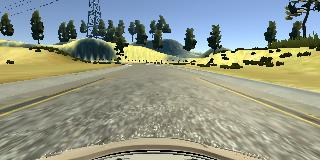

# Behavioral Cloning Project Report

## The goals / steps of this project are the following:

- Use the simulator to collect data of good driving behavior
- Build, a convolution neural network in Keras that predicts steering angles from images
- Train and validate the model with a training and validation set
- Test that the model successfully drives around track one without leaving the road
- Summarize the results with a written report

This project is graded according to the criteria in the [project rubric](https://review.udacity.com/#!/rubrics/432/view).

## Project Requirements

The project requires the following libraries/software:

- Python 3.5.2
- Tensorflow 1.0.0
- Keras 1.2.1
- Numpy 1.11.3
- OpenCV 3.1.0
- SciKit-Learn 0.18
- Udacity's Self Driving Car Simulator

## Project files

The project includes the following files:

- **model.py** containing the script to create and train the model
- **drive.py** for driving the car in autonomous mode
- **writeup\_report.pdf** summarizing the results

Using the Udacity provided simulator and my **drive.py** file, the car can drive autonomously around the track by executing

**python drive.py model.h5**

The **model.py** file contains the code for training and saving the convolution neural network. The file shows the pipeline I used for training and validating the model, and it contains comments to explain how the code works.

## Model Architecture and Training Strategy

### Model Architecture

The architecture of this model is coded in the **build\_model()** function of **model.py**. The model expects an image in the shape **(80, 160, 3)**. The model consists of the following layers:

| 1 | Cropping 2D Layer | **(Preprocessing)** Crops top by 25 pixels, bottom by 12 pixels |
| --- | --- | --- |
| 2 | Normalization Layer | **(Preprocessing)** Keras Lambda Layer (Normalizing between [-1, 1]) |
| 3 | Convolution2D layer 1 | 3@1x1 convolution filters |
| 4 | Convolution2D layer 2 | 18@5x5 convolution filters |
| 5 | Convolution2D layer 3 | 24@3x3 convolution filters |
| 6 | MaxPooling2D | 2x2 Pool size |
| 7 | Dropout | 0.5 keep probability |
| 8 | ReLU activation |   |
| 9 | Flatten Layer |   |
| 10 | Fully connected layer 1 | 550 neurons |
| 11 | ReLU activation |   |
| 12 | Fully connected layer 2 | 100 neurons |
| 13 | ReLU activation |   |
| 14 | Fully connected layer 3 | 80 neurons |
| 15 | ReLU activation |   |
| 16 | Fully connected layer 4 | 1 neuron |

### Initial Considerations

Following the advice given by Paul Heraty on the Udacity forum( [Behavioral Cloning cheatsheet](https://carnd-forums.udacity.com/questions/26214464/behavioral-cloning-cheatsheet)), from the lectures, and from the [NVIDIA paper](http://images.nvidia.com/content/tegra/automotive/images/2016/solutions/pdf/end-to-end-dl-using-px.pdf), the following ideas were considered:

- Scaling down to reduce memory consumption
- Normalizing images for better learning
- Using inputs from all 3 cameras
- Make sure the model works well on a tiny dataset first

### Design Approach

**Make sure I start from a good base network**

I found the design approach used by Paul Heraty to be very clean, systematic and efficient. Before using his method I was iterating very slowly (make a change, retrain, test run, repeat). After adopting his method, I found a viable model in a very short time, and this model learnt better and produced better results with less training data. I will describe this approach here.

I first started out with a rough, basic architecture of:

1 Convolution layer 12@5x5 &#8594; ReLU &#8594; 1 fully connected layer (100 neurons) &#8594; Output

The model used an **Adam Optimizer** , and used **Mean Squared Error** as the loss function.

I then captured training images for the **center** , **left** and **right** cameras for a given angle ( **-0.47** , **2.63** , and **-3.57** degrees respectively). I then trained the model for **50 Epochs** (which only took &lt; 10 seconds since it&#39;s only 3 images). The aim was to overfit the data and predict the correct angle when given an input image.

Thanks to the fast iteration cycle, I could very quickly see that the model was unable to predict anywhere near the desired angle. I then modified the model and repeated the process, and finally arrived at a decent model that could reliably predict angles for those 3 images. I then used this as a basis for fine tuning and training on larger datasets.

Once I had a **good base** to start with, fine tuning the model became a much easier task.

### Choice of Layers and Rationale

My main objective is to get the network to do just **two** things right:

- **Detect enough useful features** from the images
- **Perform regression** on those useful features and predict a good steering angle

To do that I mentally grouped my layers into the **Feature Detection group** and the **Regression group**.

After training my base network on a larger dataset (full driving track), I noticed the following problems:
- The car had problems handling turns missing a lane line (first turn after bridge)
- The car had problems handling sharp turns (second turn after bridge)
- The car had problems crossing the bridge (it would suddenly do a hard turn to the right)

These problems above gave clues into the weaknesses of the network, which helped a lot with tweaking.

**Tweaking the Feature Detection Group**

I started with a base network that was already capturing enough features for the Regression Group to differentiate between the 3 camera angles at a single point in the road. Since the car had problems when the road was visually different (sharp turns, turns missing a lane line, and bridges), it was likely that the feature detection capabilities were not sufficient. I **added an additional convolution layer** , and **increased the filter depths** of the second and third convolution.

**Tweaking the Regression Group**

Another possible cause of the problems above was that the Regression Group was not sufficient to perform regression on those different cases. I **added an additional fully connected layer** with **more neurons** at the beginning of the group, so that the following layers have more neurons to handle the increased complexity of the input coming from the Feature Detection Group.

As shown in the video recording, after these changes, the car is now able to drive around the track and stay within the drivable region.

### Attempts to reduce overfitting

Several steps were taken to reduce overfitting:
- Used a Dropout layer
- Used a Max Pooling layer
- Augmented the data (described in a later section)
- Utilized Keras&#39; early Stop callback feature (monitoring **val\_loss** with a **patience** of **2** )

### Model Parameter Tuning

The following parameters went through multiple rounds of tuning:

**Convolution Filter Depths and Kernel Sizes**

The CNN described in the NVIDIA paper used deeper filters with larger kernels in each layer compared to this project. The machine ran out of memory when I attempted a filter depth of **32** with a **5x5 kernel** , so I ended up compromising with shallower filters with increasing depth **(3**  &#8594;  **18**  &#8594; **24)**.

**Max Pooling Pool Size**

A max pooling layer was introduced to make the network invariant to small translations, which is useful since a car won&#39;t be exactly at the same point on the road every time. At first, I attempted a pooling size of **10x10** since the image was quite large, but the model lost too much accuracy. I settled back at a pooling size of **2x2**. In hindsight, instead of a sequential model, perhaps an inception model that merges two separate channels (one with a larger maxpool for greater translation invariance and lesser detail, and another without maxpooling for greater detail) might have been an interesting architecture to explore for this problem.

**Fully Connected Layers**

Initially started with two FC layers before the final output layer with **160** and **80** neurons each. But the model underfited and didn&#39;t learn certain parts of the track properly (when crossing the bridge and at the sharp corner without lane markers immediately after the bridge). Increasing the number of neurons didn&#39;t help as much as adding another layer. The final design that worked well has **550**  &#8594;  **100**  &#8594;  **80**  &#8594;  **1 neurons**.

## Dataset Preparation and Augmentation

### Capturing Good Driving Behaviour as Training Data

4 types of driving behaviour were captured as part of the training:
- Center lane driving
- Recovery driving
- Turning (for both slow and sharp turns)
- Bridge crossing

These were captured by the Udacity Simulator in Training Mode. Center lane driving data serves as the main training material. Recovery driving data helps the car return to the drivable portion of the road in case it starts veering off track. Turning training is necessary because some turns in the track only have lane markers on one side, and look different from the normal road. Training for bridge crossing is also done for a similar reason.

### Creation of the Training Set &amp; Training Process

**Data Augmentation**

To avoid overfitting, the training dataset was augmented in the following ways:
- Images and steering angles were flipped horizontally to help the network generalize beyond left turns
- Images from the **Left** , **Center** , and **Right Cameras** were used, together with an angle correction of **3.1° towards the center** for the left and right cameras.

| **Left camera (+3.1°)** | **Center camera (0°)** | **Right camera (-3.1°)** |
| --- | --- | --- |
|  |  |  |

### Preprocessing

The following data pre-processing steps were also taken:

- **Scaled down image** by a **factor of 2** to speed up processing/training and reduce memory consumption
- **Cropped irrelevant parts** of the image so the network won&#39;t have to learn unnecessary features
- **Normalized the image** between **-1** and **1** to make it neural network friendly

### Splitting Data into Training, Test, and Validation Sets

The training data is shuffled and split into Training (90%), Test (5%) and Validation (5%) Sets.

### Results Summary
| Metrics | Values |
| :------ | -----: |
| **Number of Epochs** | 10 |
| **Training loss** | 0.00049 |
| **Validation loss** | 0.00093 |
| **Test loss** | 0.00085 |

### Thoughts and Observations

At the very beginning, I tried designing my network using trial and error and it was slow and painful. The most valuable takeaway from this project was the importance of iterating quickly and getting the base model right first using just a tiny amount of training data. When you are confident that the initial network is learning properly, tweaking and troubleshooting becomes a lot easier when you move on to larger datasets. I also noticed that when the model is learning properly, I needed a lot less training data and training time to produce the same results. This has been a valuable lesson for me.
